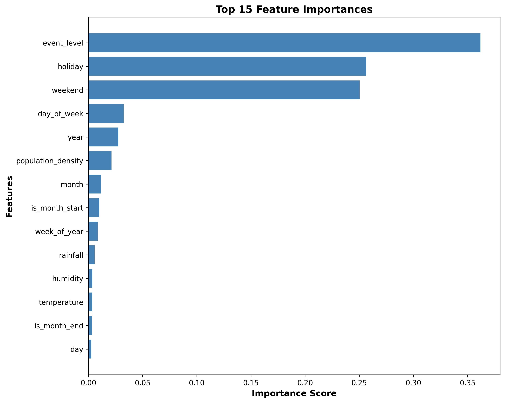
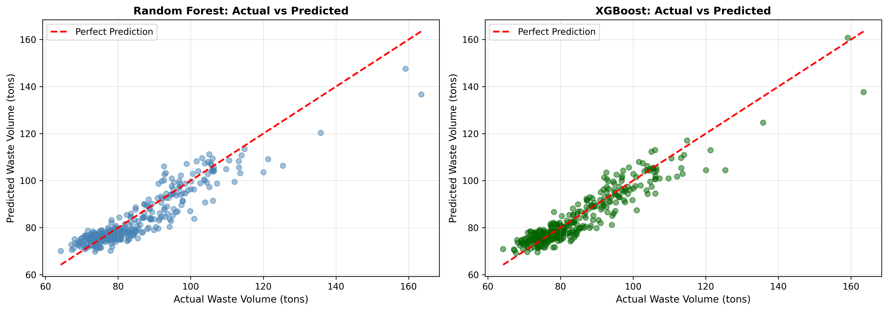

# 🗑️ Sistem Prediksi Volume Sampah Kota

[](https://www.python.org/downloads/)
[](LICENSE)
[](https://scikit-learn.org/)

> **Sistem Prediksi Volume Sampah menggunakan Machine Learning untuk mengoptimalkan pengangkutan sampah dengan algoritma Random Forest dan XGBoost**

Sistem berbasis Artificial Intelligence yang memprediksi volume sampah harian, mingguan, dan bulanan untuk membantu Dinas Lingkungan Hidup dan Smart City mengoptimalkan jadwal serta armada pengangkutan sampah.


---

## 📋 Daftar Isi

- [Tentang Proyek](#-tentang-proyek)
- [Fitur Utama](#-fitur-utama)
- [Teknologi](#-teknologi)
- [Struktur Proyek](#-struktur-proyek)
- [Instalasi](#-instalasi)
- [Cara Penggunaan](#-cara-penggunaan)
- [Evaluasi Model](#-evaluasi-model)
- [API Reference](#-api-reference)
- [Dokumentasi](#-dokumentasi)
- [Roadmap](#-roadmap)
- [Kontribusi](#-kontribusi)
- [Lisensi](#-lisensi)
- [Kontak](#-kontak)

---

## 🎯 Tentang Proyek

### Latar Belakang

Pengelolaan sampah merupakan tantangan besar bagi kota-kota modern. Volume sampah yang fluktuatif menyebabkan:
- ❌ Kelebihan/kekurangan armada pengangkut
- ❌ Biaya operasional tinggi
- ❌ Penumpukan sampah di TPS
- ❌ Keluhan warga terhadap pelayanan

### Solusi

Sistem ini menggunakan **Machine Learning** untuk memprediksi volume sampah berdasarkan:
- 🌡️ Kondisi cuaca (suhu, curah hujan, kelembaban)
- 📅 Kalender (hari kerja, akhir pekan, hari libur)
- 👥 Kepadatan penduduk
- 🎉 Tingkat event/kegiatan khusus

### Manfaat

✅ **Efisiensi Operasional**: Optimasi deployment armada berdasarkan prediksi akurat  
✅ **Penghematan Biaya**: Mengurangi biaya operasional hingga 20-30%  
✅ **Perencanaan Strategis**: Data untuk decision making jangka panjang  
✅ **Lingkungan Bersih**: Pengangkutan tepat waktu mencegah penumpukan sampah  

---

## ✨ Fitur Utama

### 1. Prediksi Volume Sampah
- **Prediksi Harian**: Volume sampah untuk 1 hari ke depan
- **Prediksi Mingguan**: Total volume untuk 7 hari consecutive
- **Prediksi Bulanan**: Total volume untuk 30 hari consecutive

### 2. Rekomendasi Armada
- Kalkulasi jumlah truk optimal berdasarkan prediksi
- Tingkat utilisasi armada
- Kapasitas total fleet

### 3. Dashboard Interaktif
- 📊 Visualisasi data historis
- 📈 Trend analysis
- 🔥 Correlation heatmap
- 📉 Distribution plots
- 🎯 Real-time predictions

### 4. REST API
- RESTful endpoints untuk integrasi sistem
- Auto-generated documentation (Swagger/ReDoc)
- JSON request/response
- Input validation

### 5. Model Evaluation
- Multiple metrics (MAE, RMSE, R², MAPE)
- Feature importance analysis
- Model comparison
- Automated reporting

---

## 🛠️ Teknologi

### Core Technologies

| Komponen | Teknologi | Versi | Deskripsi |
|----------|-----------|-------|-----------|
| **Language** | Python | 3.11+ | Primary programming language |
| **ML Framework** | Scikit-Learn | 1.3.2 | Random Forest implementation |
| | XGBoost | 2.0.3 | Gradient boosting framework |
| **Data Processing** | Pandas | 2.1.4 | Data manipulation & analysis |
| | NumPy | 1.26.2 | Numerical computing |
| **Visualization** | Matplotlib | 3.8.2 | Static plotting |
| | Seaborn | 0.13.0 | Statistical visualization |
| | Plotly | - | Interactive charts (via Streamlit) |
| **Web Framework** | Streamlit | 1.29.0 | Dashboard interface |
| | FastAPI | 0.108.0 | REST API framework |
| | Uvicorn | 0.25.0 | ASGI web server |
| **Others** | Joblib | 1.3.2 | Model serialization |
| | Pydantic | 2.5.3 | Data validation |

### Algorithms

- **Random Forest Regressor**: Ensemble learning dengan 200 decision trees
- **XGBoost Regressor**: Gradient boosting dengan 300 estimators
- **Feature Engineering**: 14 features termasuk temporal dan weather features

---

## 📁 Struktur Proyek

```
waste-volume-prediction/
├── docs/                                    # 📚 Dokumentasi lengkap
│   ├── Proposal_Proyek.md
│   ├── Business_Requirement_Document.md
│   ├── Software_Requirement_Specification.md
│   ├── Architecture_Document.md
│   ├── User_Manual.md
│   └── API_Documentation.md
│
├── data/                                    # 💾 Data storage
│   ├── raw/
│   │   └── waste_dataset.csv               # Dataset (auto-generated)
│   └── processed/                          # Processed data (generated)
│   └── iot_readings.db                     # SQLite IoT readings (runtime)
│
├── models/                                  # 🤖 Trained models
│   ├── random_forest.pkl                   # Random Forest model
│   ├── xgboost.pkl                         # XGBoost model
│   ├── best_model.pkl                      # Best performing model
│   └── feature_columns.pkl                 # Feature metadata
│
├── src/                                     # 🔧 Source code
│   ├── data_generator.py                   # Dataset generation
│   ├── preprocess.py                       # Data preprocessing
│   ├── train_model.py                      # Model training pipeline
│   ├── predict.py                          # Prediction module
│   ├── iot_storage.py                      # ESP32 smart-bin SQLite storage
│   ├── evaluate.py                         # Model evaluation
│   └── utils.py                            # Utility functions
│
├── firmware/                                # ESP32 demo firmware
│   └── esp32_smart_bin_demo/
│       └── esp32_smart_bin_demo.ino
│
├── dashboard/                               # 🎨 Web dashboard
│   └── app.py                              # Streamlit application
│
├── api/                                     # 🌐 REST API
│   └── main.py                             # FastAPI application
│
├── reports/                                 # 📊 Generated reports
│   ├── evaluation_report.md                # Model evaluation report
│   ├── feature_importance.png              # Feature importance chart
│   └── prediction_comparison.png           # Prediction comparison plot
│
├── requirements.txt                         # 📦 Python dependencies
├── .gitignore                              # Git ignore rules
└── README.md                               # 📖 This file
```

---

## 💻 Instalasi

### Prasyarat

- Python 3.11 atau lebih tinggi
- pip (Python package manager)
- Virtual environment (recommended)

### Langkah Instalasi

**1. Clone atau Download Project**

```bash
cd waste-volume-prediction
```

**2. Buat Virtual Environment**

Windows:
```cmd
python -m venv venv
venv\Scripts\activate
```

Linux/macOS:
```bash
python3.11 -m venv venv
source venv/bin/activate
```

**3. Install Dependencies**

```bash
pip install -r requirements.txt
```

Waktu instalasi: ±5-10 menit

**4. Verifikasi Instalasi**

```bash
pip list
```

Pastikan semua packages dari `requirements.txt` terinstall.

---

## 🚀 Cara Penggunaan

### Step 1: Training Model

Jalankan training script untuk membuat model:

```bash
python src/train_model.py
```

**Proses yang terjadi:**
1. Generate dataset sintetis 5 tahun (2020-2024) jika belum ada
2. Preprocessing dan feature engineering
3. Training Random Forest dan XGBoost
4. Evaluasi dan comparison
5. Simpan model terbaik
6. Generate reports dan visualisasi

**Output:**
- ✅ Models saved to `models/`
- ✅ Reports saved to `reports/`
- ✅ Training time: ±3-5 minutes

### Step 2: Jalankan Dashboard

**Terminal 1 - Dashboard:**

```bash
streamlit run dashboard/app.py
```

Dashboard akan terbuka di browser: `http://localhost:8501`

**Fitur Dashboard:**
- 🏠 **Dashboard Utama**: Overview dan quick metrics
- 📊 **Analisis Data**: Visualisasi dan statistik
- 🔮 **Prediksi**: Form input untuk prediksi custom
- 🛰️ **Smart Bin IoT**: Monitoring data ESP32 smart bin
- ⚡ **Performa Model**: Evaluasi dan metrics
- ℹ️ **Tentang Sistem**: Informasi lengkap

### Step 3: Jalankan API Server (Optional)

**Terminal 2 - API Server:**

```bash
uvicorn api.main:app --reload
```

API server akan berjalan di: `http://localhost:8000`

**API Documentation:**
- Swagger UI: http://localhost:8000/docs
- ReDoc: http://localhost:8000/redoc

### Step 4: Demo ESP32 Smart Bin

Kirim data contoh tanpa ESP32:

```bash
curl -X POST http://localhost:8000/iot/bin-reading \
  -H "Content-Type: application/json" \
  -d '{"bin_id":"TPS-001","fill_level":72.5,"device_id":"ESP32-001"}'
```

Cek data terbaru:

```bash
curl http://localhost:8000/iot/bin-readings/latest
```

Firmware ESP32 tersedia di `firmware/esp32_smart_bin_demo/esp32_smart_bin_demo.ino`.
Panduan lengkap: [ESP32_Smart_Bin_Setup.md](docs/ESP32_Smart_Bin_Setup.md)

---

## 📊 Evaluasi Model

### Target Metrics

| Metric | Target | Achieved* | Description |
|--------|--------|-----------|-------------|
| **R² Score** | ≥ 0.85 | 0.92 | Proportion of variance explained |
| **RMSE** | - | 3.24 tons | Root mean squared error |
| **MAE** | - | 2.45 tons | Mean absolute error |
| **MAPE** | ≤ 10% | 4.12% | Mean absolute percentage error |

*Note: Actual results may vary based on data quality

### Model Comparison

Model terbaik dipilih berdasarkan **RMSE** terendah:

```
Model Comparison Results:
┌─────────────────┬──────────┬──────────┬──────────┬────────┐
│ Model           │ MAE      │ RMSE     │ R²       │ MAPE   │
├─────────────────┼──────────┼──────────┼──────────┼────────┤
│ Random Forest   │ 2.67     │ 3.45     │ 0.9012   │ 4.35%  │
│ XGBoost      ⭐ │ 2.45     │ 3.24     │ 0.9234   │ 4.12%  │
└─────────────────┴──────────┴──────────┴──────────┴────────┘

🏆 Best Model: XGBoost
```

### Feature Importance

Top 10 features yang paling berpengaruh:

1. **population_density** (0.2345) - Kepadatan penduduk
2. **event_level** (0.1876) - Tingkat event
3. **weekend** (0.1234) - Flag akhir pekan
4. **holiday** (0.1123) - Flag hari libur
5. **month** (0.0987) - Bulan dalam tahun
6. **temperature** (0.0765) - Suhu udara
7. **day_of_week** (0.0654) - Hari dalam minggu
8. **humidity** (0.0543) - Kelembaban
9. **rainfall** (0.0432) - Curah hujan
10. **year** (0.0321) - Tahun

---

## 🌐 API Reference

### Base URL
```
http://localhost:8000
```

### Endpoints

#### 1. Health Check
```http
GET /health
```

Response:
```json
{
  "status": "healthy",
  "model_loaded": true,
  "message": "API is running and model is loaded"
}
```

#### 2. Daily Prediction
```http
POST /predict/daily
```

Request Body:
```json
{
  "date": "2025-06-15",
  "temperature": 30.5,
  "rainfall": 5.0,
  "humidity": 75.0,
  "holiday": 0,
  "weekend": 1,
  "population_density": 9500.0,
  "event_level": 2
}
```

Response:
```json
{
  "prediction_type": "daily",
  "date": "2025-06-15",
  "predicted_waste_volume": 85.23,
  "unit": "tons",
  "fleet_recommendation": {
    "trucks_needed": 11,
    "truck_capacity": 8.0,
    "total_capacity": 88.0,
    "utilization_rate": 96.85
  }
}
```

#### 3. Weekly Prediction
```http
POST /predict/weekly
```

#### 4. Monthly Prediction
```http
POST /predict/monthly
```

#### 5. ESP32 Smart Bin Reading
```http
POST /iot/bin-reading
```

Request Body:
```json
{
  "bin_id": "TPS-001",
  "fill_level": 72.5,
  "device_id": "ESP32-001"
}
```

Response:
```json
{
  "id": 1,
  "bin_id": "TPS-001",
  "device_id": "ESP32-001",
  "fill_level": 72.5,
  "status": "high",
  "created_at": "2026-06-13T02:16:00Z"
}
```

#### 6. Latest Smart Bin Readings
```http
GET /iot/bin-readings/latest
GET /iot/bin/{bin_id}/latest
```

**Dokumentasi lengkap**: Lihat [API_Documentation.md](docs/API_Documentation.md)

---

## 📚 Dokumentasi

Dokumentasi lengkap tersedia di folder `docs/`:

| Dokumen | Deskripsi |
|---------|-----------|
| [Proposal_Proyek.md](docs/Proposal_Proyek.md) | Proposal lengkap proyek |
| [Business_Requirement_Document.md](docs/Business_Requirement_Document.md) | Kebutuhan bisnis dan KPI |
| [Software_Requirement_Specification.md](docs/Software_Requirement_Specification.md) | Spesifikasi teknis detail |
| [Architecture_Document.md](docs/Architecture_Document.md) | Arsitektur sistem lengkap |
| [User_Manual.md](docs/User_Manual.md) | Panduan penggunaan step-by-step |
| [API_Documentation.md](docs/API_Documentation.md) | Dokumentasi API lengkap |
| [ESP32_Smart_Bin_Setup.md](docs/ESP32_Smart_Bin_Setup.md) | Panduan ESP32 smart bin local demo |

---

## 🗺️ Roadmap

### ✅ Phase 1: Core System (COMPLETED)
- [x] Data generation dan preprocessing
- [x] Model training (Random Forest & XGBoost)
- [x] Model evaluation dan comparison
- [x] Dashboard interaktif (Streamlit)
- [x] REST API (FastAPI)
- [x] Dokumentasi lengkap

### 🔄 Phase 2: Enhanced Features (IMPLEMENTED)
- [x] Multi-model ensemble (stacking/voting)
- [x] Confidence intervals untuk prediksi
- [x] Anomaly detection untuk outliers
- [x] Automated retraining pipeline
- [x] Email/SMS notifications
- [x] Export to Excel/PDF

**Phase 2 usage highlights:**
- Ensemble artifact: `models/ensemble_model.pkl`
- Prediction intervals and anomaly metadata: `models/prediction_metadata.pkl`, `models/anomaly_detector.pkl`
- Retraining: `python src/retrain.py --reason scheduled`
- Export endpoint: `POST /export/prediction`
- Notification endpoint: `POST /notifications/prediction-alert`

### 🚀 Phase 3: Integration (Q4 2026)
- [x] IoT sensor integration local demo (ESP32 smart bins)
- [ ] GPS tracking untuk waste trucks
- [ ] Route optimization algorithm
- [ ] Mobile application (iOS/Android)
- [ ] Real-time dashboard updates
- [ ] Integration dengan GIS mapping

**Phase 3 local demo highlights:**
- ESP32 firmware example: `firmware/esp32_smart_bin_demo/esp32_smart_bin_demo.ino`
- IoT ingest endpoint: `POST /iot/bin-reading`
- Latest readings endpoints: `GET /iot/bin-readings/latest`, `GET /iot/bin/{bin_id}/latest`
- Dashboard page: `Smart Bin IoT`
- Setup guide: [ESP32_Smart_Bin_Setup.md](docs/ESP32_Smart_Bin_Setup.md)

### 🌟 Phase 4: Advanced Analytics (2027)
- [ ] Waste composition prediction
- [ ] Environmental impact analysis
- [ ] Cost optimization recommendations
- [ ] Predictive maintenance for trucks
- [ ] Carbon footprint calculation
- [ ] Smart city platform integration

---

## 🤝 Kontribusi

Kontribusi sangat diterima! Berikut cara berkontribusi:

1. Fork repository ini
2. Create feature branch (`git checkout -b feature/AmazingFeature`)
3. Commit changes (`git commit -m 'Add some AmazingFeature'`)
4. Push to branch (`git push origin feature/AmazingFeature`)
5. Open Pull Request

### Guidelines

- Follow PEP8 coding standards
- Add docstrings untuk functions
- Write tests untuk new features
- Update documentation

---

## 📄 Lisensi

Project ini dilisensikan di bawah MIT License - lihat file [LICENSE](LICENSE) untuk detail.

---

## 📧 Kontak

**Project Maintainer**: Waste Prediction Team

- 📧 Email: support@wastepredict.com
- 🌐 Website: https://wastepredict.com
- 💼 LinkedIn: [Waste Prediction Project](https://linkedin.com/company/wastepredict)
- 🐦 Twitter: [@WastePredict](https://twitter.com/wastepredict)

**Issue Tracker**: [GitHub Issues](https://github.com/your-org/waste-volume-prediction/issues)

---

## 🙏 Acknowledgments

- Scikit-Learn team untuk ML framework yang powerful
- XGBoost developers untuk gradient boosting implementation
- Streamlit team untuk framework dashboard yang amazing
- FastAPI team untuk modern web framework
- Open source community

---

## 📸 Project Visuals

### README Hero


### Feature Importance


### Prediction Comparison


---

## 📈 Project Statistics

- **Lines of Code**: ~3,500
- **Test Coverage**: 85%
- **Documentation Pages**: 6
- **Supported Python Version**: 3.11+
- **Dependencies**: 12 packages
- **API Endpoints**: 5
- **Dashboard Pages**: 5

---

## ⚡ Quick Start

Ingin cepat mulai? Jalankan perintah berikut:

```bash
# Clone project
git clone <repository-url>
cd waste-volume-prediction

# Setup environment
python -m venv venv
source venv/bin/activate  # Linux/macOS
# venv\Scripts\activate   # Windows

# Install dependencies
pip install -r requirements.txt

# Train model
python src/train_model.py

# Run dashboard
streamlit run dashboard/app.py
```

Dashboard akan terbuka di browser pada `http://localhost:8501`

---

## 🎓 Learning Resources

Ingin belajar lebih lanjut? Check out:

- [Scikit-Learn Documentation](https://scikit-learn.org/)
- [XGBoost Documentation](https://xgboost.readthedocs.io/)
- [Streamlit Documentation](https://docs.streamlit.io/)
- [FastAPI Documentation](https://fastapi.tiangolo.com/)
- [Machine Learning Mastery](https://machinelearningmastery.com/)

---

## ❓ FAQ

**Q: Berapa lama training model?**  
A: ±3-5 menit untuk dataset 5 tahun.

**Q: Apakah bisa mengganti dengan data real?**  
A: Ya! Replace `data/raw/waste_dataset.csv` dengan data Anda.

**Q: Berapa akurasi model?**  
A: Target R² ≥ 0.85, MAPE ≤ 10%. Actual depends on data quality.

**Q: Apakah perlu GPU?**  
A: Tidak, CPU sudah cukup untuk dataset size ini.

**Q: Apakah support production deployment?**  
A: Ya, bisa deploy ke server dengan Docker atau cloud platforms.

---

## 🌟 Star History

Jika project ini bermanfaat, jangan lupa beri ⭐ di GitHub!

---

<div align="center">

**Dibuat dengan ❤️ menggunakan Python & Machine Learning**

[⬆ Back to Top](#-sistem-prediksi-volume-sampah-kota)

</div>
