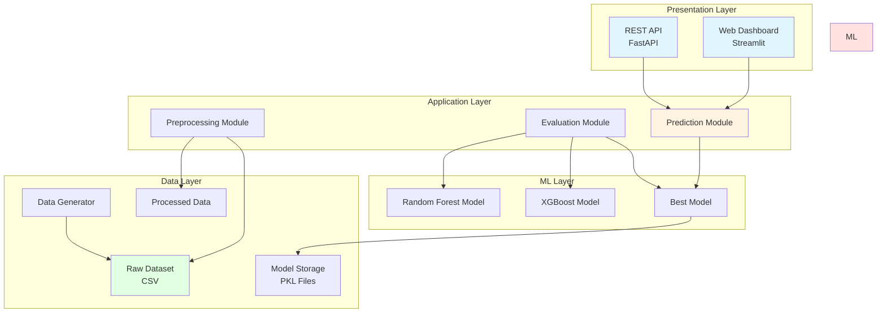
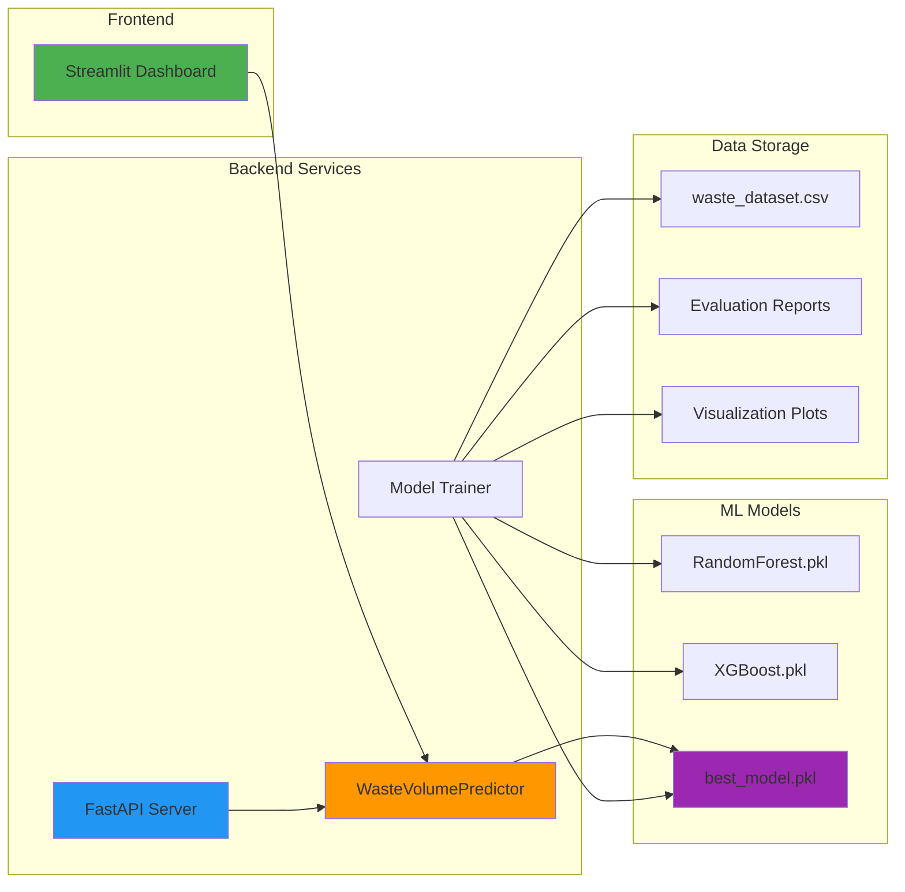
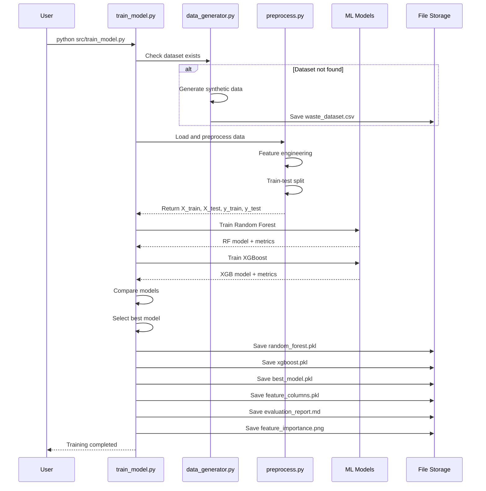
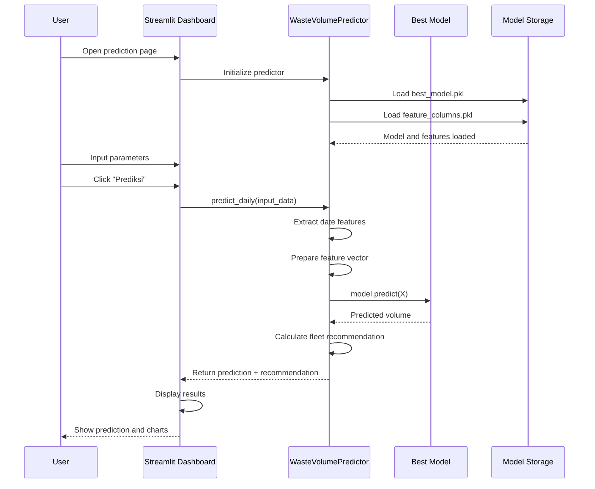
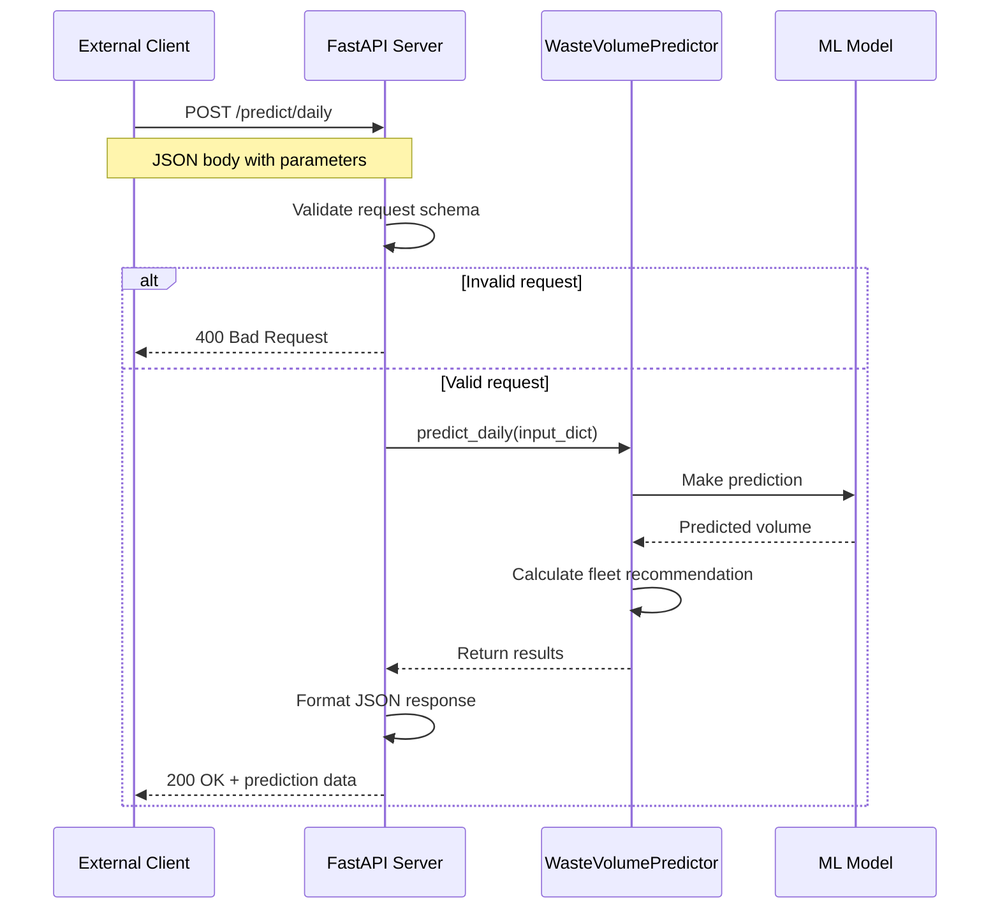
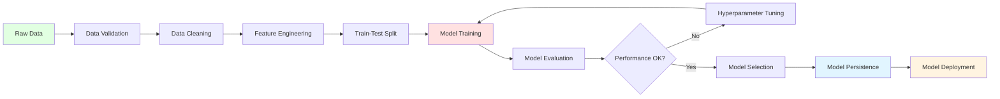
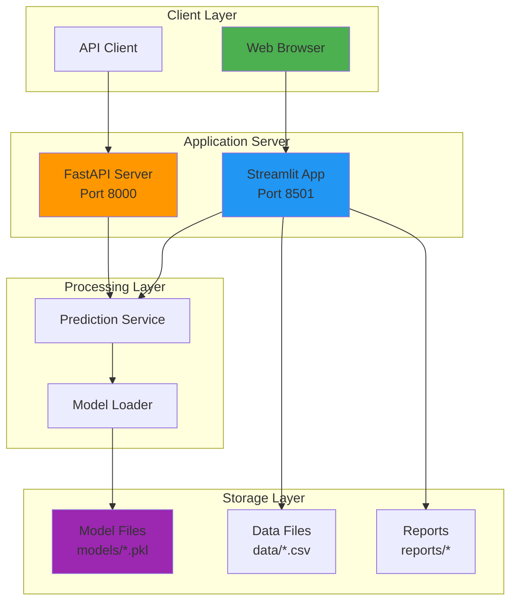
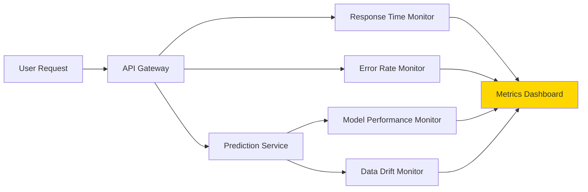

# Architecture Document
## Sistem Prediksi Volume Sampah Kota

---

## 1. Overview

### 1.1 Deskripsi Sistem
Sistem Prediksi Volume Sampah adalah aplikasi berbasis Machine Learning yang menggunakan arsitektur modular dengan komponen:
- **Data Layer**: Data storage dan preprocessing
- **ML Layer**: Model training dan prediction
- **Application Layer**: Dashboard dan REST API
- **Presentation Layer**: Web interface

### 1.2 Prinsip Arsitektur
- **Separation of Concerns**: Setiap komponen memiliki tanggung jawab yang jelas
- **Modularity**: Komponen dapat dikembangkan dan di-deploy secara independen
- **Scalability**: Dapat di-scale horizontal maupun vertical
- **Maintainability**: Mudah di-maintain dan di-extend

---

## 2. Arsitektur Sistem

### 2.1 High-Level Architecture



### 2.2 Component Diagram



---

## 3. Data Flow

### 3.1 Training Flow



### 3.2 Prediction Flow



### 3.3 API Request Flow



---

## 4. ML Pipeline

### 4.1 ML Pipeline Architecture



### 4.2 Feature Engineering Pipeline

```
Raw Features:
├── date (string)
├── temperature (float)
├── rainfall (float)
├── humidity (float)
├── holiday (int)
├── weekend (int)
├── population_density (float)
└── event_level (int)

Feature Engineering:
├── Date Decomposition:
│   ├── day (1-31)
│   ├── month (1-12)
│   ├── year (2020-2024)
│   ├── day_of_week (0-6)
│   ├── week_of_year (1-53)
│   ├── is_month_start (0/1)
│   └── is_month_end (0/1)
└── Drop: date (not used in training)

Final Features (14 dimensions):
├── temperature
├── rainfall
├── humidity
├── holiday
├── weekend
├── population_density
├── event_level
├── day
├── month
├── year
├── day_of_week
├── week_of_year
├── is_month_start
└── is_month_end
```

---

## 5. Deployment Architecture

### 5.1 Deployment Diagram



### 5.2 Container Deployment (Optional)

```
Docker Container:
┌─────────────────────────────────────┐
│  waste-volume-prediction-app        │
├─────────────────────────────────────┤
│  OS: Ubuntu 22.04                   │
│  Python: 3.11                       │
│                                     │
│  Services:                          │
│  ├── Streamlit (port 8501)         │
│  └── FastAPI (port 8000)           │
│                                     │
│  Volumes:                           │
│  ├── /app/data (persistent)        │
│  ├── /app/models (persistent)      │
│  └── /app/reports (persistent)     │
└─────────────────────────────────────┘
```

---

## 6. Technology Stack

### 6.1 Technology Matrix

| Layer | Technology | Version | Purpose |
|-------|------------|---------|---------|
| **Language** | Python | 3.11 | Primary programming language |
| **ML Framework** | Scikit-Learn | 1.3.2 | Random Forest implementation |
| | XGBoost | 2.0.3 | Gradient boosting implementation |
| **Data Processing** | Pandas | 2.1.4 | Data manipulation |
| | NumPy | 1.26.2 | Numerical computing |
| **Visualization** | Matplotlib | 3.8.2 | Static plotting |
| | Seaborn | 0.13.0 | Statistical visualization |
| | Plotly | (via Streamlit) | Interactive charts |
| **Web Framework** | Streamlit | 1.29.0 | Dashboard interface |
| | FastAPI | 0.108.0 | REST API framework |
| | Uvicorn | 0.25.0 | ASGI server |
| **Model Persistence** | Joblib | 1.3.2 | Model serialization |
| **Validation** | Pydantic | 2.5.3 | Data validation |

### 6.2 Dependency Graph

```
waste-volume-prediction
├── Python 3.11+
├── Core ML Libraries
│   ├── scikit-learn (Random Forest)
│   ├── xgboost (XGBoost)
│   └── joblib (Model persistence)
├── Data Libraries
│   ├── pandas (DataFrame operations)
│   └── numpy (Numerical arrays)
├── Visualization
│   ├── matplotlib (Base plotting)
│   ├── seaborn (Statistical plots)
│   └── plotly (Interactive charts)
├── Web Frameworks
│   ├── streamlit (Dashboard)
│   │   └── plotly (Charts)
│   └── fastapi (API)
│       ├── uvicorn (Server)
│       ├── pydantic (Validation)
│       └── python-multipart (Form data)
└── Development Tools
    ├── logging (Built-in)
    ├── pathlib (Built-in)
    └── datetime (Built-in)
```

---

## 7. Security Architecture

### 7.1 Security Layers

```
┌─────────────────────────────────────┐
│  Presentation Layer                 │
│  ├── Input Validation              │
│  ├── HTTPS (optional)              │
│  └── CORS Policy                   │
├─────────────────────────────────────┤
│  Application Layer                  │
│  ├── Input Sanitization            │
│  ├── Error Handling                │
│  └── Rate Limiting (optional)      │
├─────────────────────────────────────┤
│  Data Layer                         │
│  ├── File Permissions              │
│  ├── Data Validation               │
│  └── Backup Strategy               │
└─────────────────────────────────────┘
```

### 7.2 Security Measures

| Component | Security Measure | Implementation |
|-----------|------------------|----------------|
| API | Input Validation | Pydantic schemas |
| API | Error Handling | Try-catch blocks, no stack traces exposed |
| API | Rate Limiting | Can be added with middleware |
| Dashboard | Input Validation | Streamlit widgets constraints |
| Models | File Access Control | OS-level permissions |
| Data | Data Validation | Schema validation in preprocessing |

---

## 8. Scalability Considerations

### 8.1 Vertical Scaling
- **CPU**: Add more cores for faster training and parallel predictions
- **RAM**: Increase memory for larger datasets and model ensembles
- **Storage**: Expand disk for more historical data

### 8.2 Horizontal Scaling
```
Load Balancer
    ├── API Instance 1 (FastAPI)
    ├── API Instance 2 (FastAPI)
    └── API Instance 3 (FastAPI)
          └── Shared Model Storage (NFS/S3)
```

### 8.3 Optimization Strategies

| Strategy | Description | Impact |
|----------|-------------|--------|
| Model Caching | Cache loaded models in memory | Reduce load time |
| Feature Caching | Cache extracted features for repeated requests | Reduce computation |
| Async Processing | Use async/await for I/O operations | Improve throughput |
| Batch Prediction | Support batch predictions | Reduce overhead |
| Model Quantization | Compress model size | Reduce memory usage |

---

## 9. Monitoring and Logging

### 9.1 Monitoring Points



### 9.2 Logging Strategy

```python
# Log Levels and Usage
INFO:    System events (startup, shutdown, model loading)
WARNING: Potential issues (slow response, high memory)
ERROR:   Errors that don't stop execution
CRITICAL: Errors that stop execution

# Log Format
{timestamp} - {module} - {level} - {message}

# Example Logs
2026-06-10 10:15:23 - predictor - INFO - Model loaded successfully
2026-06-10 10:15:45 - api - WARNING - High response time: 350ms
2026-06-10 10:16:12 - predictor - ERROR - Invalid input: temperature out of range
```

---

## 10. Disaster Recovery

### 10.1 Backup Strategy
- **Daily**: Automated backup of models and data files
- **Weekly**: Full system backup
- **Monthly**: Archive old backups

### 10.2 Recovery Plan

```
Failure Scenario: Model file corrupted
├── Step 1: Stop services
├── Step 2: Restore model from backup
├── Step 3: Validate restored model
├── Step 4: Restart services
└── Step 5: Verify system functionality

Failure Scenario: Data loss
├── Step 1: Restore data from backup
├── Step 2: Validate data integrity
├── Step 3: Retrain model if necessary
└── Step 4: Deploy new model

Failure Scenario: Complete system failure
├── Step 1: Provision new server
├── Step 2: Install dependencies
├── Step 3: Restore code from Git
├── Step 4: Restore data and models from backup
├── Step 5: Run tests
└── Step 6: Go live
```

---

## 11. Performance Benchmarks

### 11.1 Target Performance

| Metric | Target | Measurement |
|--------|--------|-------------|
| Model Training | < 10 min | 5 years data |
| Single Prediction | < 100ms | Average |
| API Response (p95) | < 200ms | Under load |
| Dashboard Load | < 3 sec | Initial load |
| System Uptime | ≥ 99% | Monthly |

### 11.2 Load Testing Scenarios

```
Scenario 1: Normal Load
├── Users: 10 concurrent
├── Duration: 1 hour
├── Expected: All targets met

Scenario 2: Peak Load
├── Users: 100 concurrent
├── Duration: 15 minutes
├── Expected: Response time < 500ms

Scenario 3: Stress Test
├── Users: 500 concurrent
├── Duration: 5 minutes
├── Expected: Graceful degradation
```

---

## 12. Future Enhancements

### 12.1 Roadmap

**Phase 2: Advanced Features**
- Multi-model ensemble (voting/stacking)
- Confidence intervals for predictions
- Anomaly detection
- Automated retraining pipeline

**Phase 3: Integration**
- IoT sensor integration (smart bins)
- GPS tracking for waste trucks
- Route optimization algorithm
- Mobile app for operators

**Phase 4: Advanced Analytics**
- Waste composition prediction
- Environmental impact analysis
- Cost optimization recommendations
- Predictive maintenance for trucks

### 12.2 Extensibility Points

```
Extension Points:
├── New Models
│   └── Add to src/train_model.py
├── New Features
│   └── Extend feature engineering in preprocess.py
├── New Data Sources
│   └── Add data connectors in data layer
├── New Visualizations
│   └── Add charts in dashboard
└── New API Endpoints
    └── Add routes in api/main.py
```

---

## 13. Glossary

| Term | Definition |
|------|------------|
| **Ensemble Learning** | Teknik ML yang menggabungkan multiple models |
| **Feature Engineering** | Proses membuat fitur baru dari data raw |
| **Hyperparameter** | Parameter model yang diset sebelum training |
| **RMSE** | Root Mean Squared Error, metrik evaluasi |
| **Pickle/PKL** | Format serialization untuk Python objects |
| **API** | Application Programming Interface |
| **REST** | Representational State Transfer |
| **ASGI** | Asynchronous Server Gateway Interface |

---

**Document Version**: 1.0  
**Author**: Architecture Team  
**Date**: 10 Juni 2026  
**Status**: Approved  
**Review Date**: Quarterly
