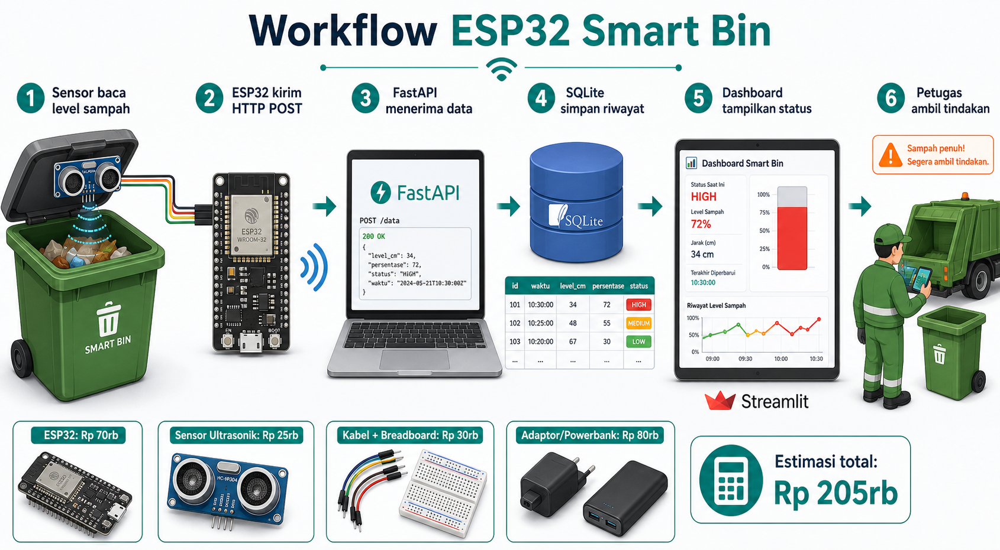

# ESP32 Smart Bin Local Demo

Panduan ini menjelaskan cara memakai ESP32 sebagai sensor smart bin untuk demo lokal. ESP32 mengirim data level sampah ke FastAPI, data disimpan di SQLite, lalu dashboard Streamlit menampilkan status terbaru.



## Komponen

| Komponen | Estimasi Harga |
|----------|----------------|
| ESP32 DevKit | Rp 70rb |
| Sensor ultrasonik HC-SR04 | Rp 25rb |
| Kabel jumper + breadboard | Rp 30rb |
| Adaptor USB atau powerbank | Rp 80rb |
| **Estimasi total** | **Rp 205rb** |

Harga hanya estimasi untuk prototipe lokal dan bisa berubah tergantung toko atau kualitas komponen.

## Alur Kerja

1. Sensor membaca level sampah.
2. ESP32 mengirim HTTP POST ke FastAPI.
3. FastAPI menerima dan memvalidasi data.
4. SQLite menyimpan riwayat pembacaan.
5. Dashboard Streamlit menampilkan fill level, status, tren, dan tabel data terbaru.
6. Petugas memakai status `low`, `medium`, `high`, atau `full` untuk mengambil tindakan.

## Menjalankan Backend

Aktifkan virtual environment, lalu jalankan API:

```powershell
.\venv\Scripts\activate
uvicorn api.main:app --reload
```

API berjalan di:

```text
http://localhost:8000
```

Jika ESP32 berada di Wi-Fi yang sama, gunakan IP laptop/server, bukan `localhost`. Contoh:

```text
http://192.168.1.100:8000/iot/bin-reading
```

## Test Manual Tanpa ESP32

Kirim data contoh:

```powershell
curl -X POST http://localhost:8000/iot/bin-reading `
  -H "Content-Type: application/json" `
  -d "{\"bin_id\":\"TPS-001\",\"fill_level\":72.5,\"device_id\":\"ESP32-001\"}"
```

Cek data terbaru:

```powershell
curl http://localhost:8000/iot/bin-readings/latest
```

Cek data terbaru untuk satu bin:

```powershell
curl http://localhost:8000/iot/bin/TPS-001/latest
```

## Dashboard

Jalankan dashboard:

```powershell
streamlit run dashboard/app.py
```

Buka halaman **Smart Bin IoT** untuk melihat:

- bin terbaru
- fill level
- status warna
- device ID
- tren fill level
- tabel riwayat pembacaan

## Firmware ESP32

Firmware demo tersedia di:

```text
firmware/esp32_smart_bin_demo/esp32_smart_bin_demo.ino
```

Sebelum upload ke ESP32, ubah nilai berikut:

```cpp
const char* WIFI_SSID = "YOUR_WIFI_NAME";
const char* WIFI_PASSWORD = "YOUR_WIFI_PASSWORD";
const char* SERVER_URL = "http://192.168.1.100:8000/iot/bin-reading";
```

Versi pertama firmware masih memakai nilai fill level simulasi. Setelah sensor fisik terpasang, ganti fungsi `readFillLevel()` dengan logika pembacaan sensor ultrasonik atau sensor berat.

## Status

Mapping status:

| Fill Level | Status |
|------------|--------|
| 0 - 39.9% | `low` |
| 40 - 69.9% | `medium` |
| 70 - 89.9% | `high` |
| 90 - 100% | `full` |

## Catatan Lokal Demo

- Tidak ada authentication pada endpoint IoT.
- Gunakan hanya di jaringan lokal untuk demo.
- Database runtime tersimpan di `data/iot_readings.db` dan diabaikan oleh Git.
- Fitur ini belum mengubah model ML; ini menambahkan monitoring smart bin real-time sederhana di samping sistem prediksi.
